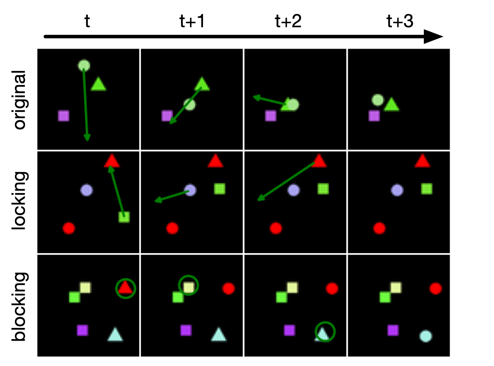

# Relational Spriteworld: Extension for Semantic Object Interactions

## Description

[Spriteworld](https://github.com/deepmind/spriteworld) is a python-based RL environment that consists of a 2-dimensional
arena with simple shapes that can be moved freely. **Relational Spriteworld**
is an extension of this environment that introduces
**semantic object interactions**. For example, objects can block or lock each other, resulting in different behaviours
on interaction.

For more information and documentation regarding the original environment, please refer
to [original repository](https://github.com/deepmind/spriteworld#readme) and the paper in which it was
introduced: ["COBRA: Data-Efficient Model-Based RL through Unsupervised Object Discovery and Curiosity-Driven Exploration" (Watters et al., 2019)](https://arxiv.org/abs/1905.09275)
.

## New Mechanics

This extension introduces new object types, semantic object states, interactions, and interaction effects that depend on
an objects semantic state. All of them can be easily configured, modified or extended.

#### Specifically, the following mechanics are introduced:

- **Locks:** special (e.g. red) objects that prevent other objects from moving
- **Clicking interaction:** clicking on an object triggers a different effect than dragging it.
- **Shape change effect:** objects can change shape (e.g. when clicked)
- **Semantic object states** (based on the relation to other objects):
  - **locked:** object cannot move if a lock with the same shape is present
  - **blocked:** object cannot change shape if touching any other object

All combined, objects can be moved by dragging (if they are not locked) and change shape by clicking (if they are not
blocked).




## Installation

Relational Spriteworld can be installed through Github:

```bash
pip install git+https://github.com/thomaschn/spriteworld
```

or alternatively by checking out a local copy of our repository and running:

```bash
git clone https://github.com/thomaschn/spriteworld
pip install spriteworld/
```

## Getting Started

#### Prerequisites

Spriteworld depends on `numpy`, `six`, `absl`, `PIL`, `matplotlib`, `sklearn`,
and `dm_env`.

#### Running The Demo

Once installed, the example configuration containing all new mechanics
`configs/relational/locking_and_blocking.py` can be run using `run_demo.py`:

```bash
python /path/to/local/spriteworld/run_demo.py --config spriteworld.configs.relational.locking_and_blocking
```

